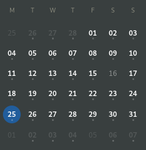
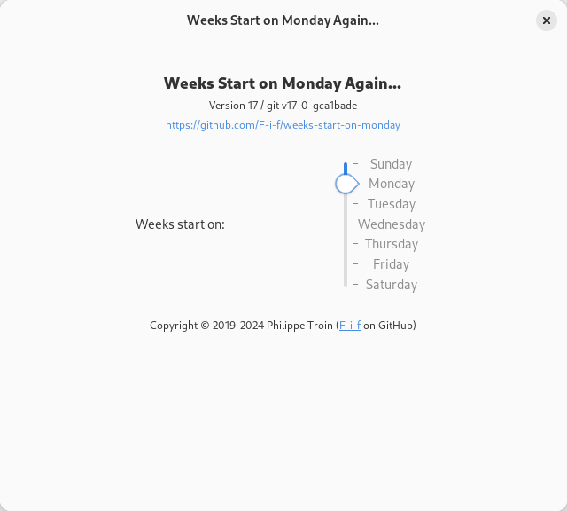

# Weeks Start on Monday Again... Gnome Shell Extension

## Overview

Weeks Start on Monday Again... is a re-implementation of the [Week
Start on
Monday...](https://extensions.gnome.org/extension/646/weeks-start-on-monday/)
Gnome Shell extension for newer Gnome Shell versions.

## Configuration

With Weeks Start on Monday Again, weeks can start any day of the week.
Just change it with the configuration panel, which can be
accessed from the "Tweaks" application or the [Gnome Shell Extensions
page](https://extensions.gnome.org/local/).

## Download / Install

~~Install directly from the [Gnome Shell Extensions
site](https://extensions.gnome.org/extension/TBD/weeks-start-on-monday/).~~
*This link won't be available until the extension is approved.*

Or download the zip file from the GitHub [releases
page](https://github.com/F-i-f/weeks-start-on-monday/releases) and
unzip [the
file](https://github.com/F-i-f/weeks-start-on-monday/download/v1/weeks-start-on-monday@extensions.gnome-shell.fifi.org.v1.shell-extension.zip)
in the
`~/.local/share/gnome-shell/extensions/weeks-start-on-monday@extensions.gnome-shell.fifi.org`
directory (you may have to create the directory).

## Building from source

### Requirements

- [meson](http://mesonbuild.com/) v0.44.0 or later.

### Running the build

- Check out: `git clone https://github.com/F-i-f/weeks-start-on-monday/`

- `cd weeks-start-on-monday`

- Run meson: `meson build`

- To install in your your gnome shell extensions' directory (~/.local/share/gnome-shell/extensions), run ninja: `ninja -C build install`

- To build the extension zip files, run: `ninja -C build extension.zip`, the extension will be found under `build/extension.zip`.

## Changelog

### Version 1
#### March 25, 2019

First public release.

## Credits

- The [`meson-gse` credits](https://github.com/F-i-f/meson-gse/) are
  included here by reference.

- [luciangabor](https://extensions.gnome.org/accounts/profile/luciangabor)
  for the original extension.

<!--  LocalWords:  extensions' Changelog luciangabor
 -->
