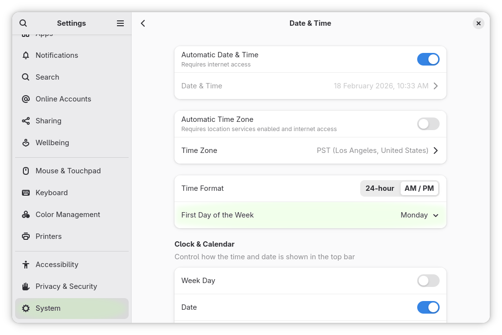

&nbsp;Weeks Start on Monday Again... Gnome Shell Extension
===========================================================================================================================

[](https://extensions.gnome.org/extension/1720/weeks-start-on-monday-again/)


## Overview

Weeks Start on Monday Again... is a re-implementation of the [Week
Start on
Monday...](https://extensions.gnome.org/extension/646/weeks-start-on-monday/)
Gnome Shell extension for newer Gnome Shell versions.

Starting with Gnome 50, the first day of the week can be configured directly in _Settings_ > _System_ > _Date & Time_:


When using Gnome Shell 3.30 through 49, read on...

## Configuration

With Weeks Start on Monday Again, weeks can start any day of the week.
Just change it with the configuration panel, which can be
accessed from the "Tweaks" application or the [Gnome Shell Extensions
page](https://extensions.gnome.org/local/).


## License

Weeks Start on Monday Again... is free software: you can redistribute
it and/or modify it under the terms of the GNU General Public License
as published by the Free Software Foundation, either version 3 of the
License, or (at your option) any later version.

This program is distributed in the hope that it will be useful, but
WITHOUT ANY WARRANTY; without even the implied warranty of
MERCHANTABILITY or FITNESS FOR A PARTICULAR PURPOSE.  See the GNU
General Public License for more details.

You should have received a copy of the GNU General Public License
along with this program.  If not, see [http://www.gnu.org/licenses/].

## Download / Install

Install directly from the [Gnome Shell Extensions
site](https://extensions.gnome.org/extension/1720/weeks-start-on-monday-again/).

Or download the [zip
file](https://github.com/F-i-f/weeks-start-on-monday/releases/download/v22/weeks-start-on-monday@extensions.gnome-shell.fifi.org.v22.shell-extension.zip)
from the GitHub [releases
page](https://github.com/F-i-f/weeks-start-on-monday/releases) and run:

``` shell
gnome-extensions install weeks-start-on-monday@extensions.gnome-shell.fifi.org.v22.shell-extension.zip
```

## Building from source

### Requirements

- [meson](http://mesonbuild.com/) v1.4.0 or later.

### Running the build

- Check out: `git clone --recurse-submodules https://github.com/F-i-f/weeks-start-on-monday/`

- `cd weeks-start-on-monday`

- Run meson: `meson setup build`

- To install in your your gnome shell extensions' directory (~/.local/share/gnome-shell/extensions), run ninja: `ninja -C build install`

- To build the extension zip files, run: `ninja -C build extension.zip`, the extension will be found under `build/extension.zip`.

## Changelog

### Version 22
#### September 11, 2025

- Russian translation, courtesy of FraxinusAcer on Github.

### Version 21
#### August 30, 2025

- Gnome Shell 49 compatibility.
- Update meson-gse.
- Bugfix release:
  - Forgot to bump version number.

### Version 20
#### August 30, 2025

- Gnome Shell 49 compatibility.
- Update meson-gse.

### Version 19
#### February 12, 2025

- Gnome Shell 48 compatibility.
- Update meson-gse:
  - Eslint configuration update.

### Version 18
#### September 11, 2024

- Gnome Shell 47 compatibility.
- Update meson-gse:
  - Now requires meson 1.4.0 or later.
  - Build now runs eslint on test, added prettier target.
- Update to pass eslint.
- Code reformatted with prettier.

### Version 17
#### April 5, 2024

- Gnome Shell 46 compatibility.

### Version 16
#### January 9, 2024

- Fix code object lifetime issues raised in rejected version 15 review.

### Version 15
#### January 9, 2024

- Gnome Shell 45 compatibility.
- Now incompatible with all older Gnome Shell lower than 45.  Version
  14 still works fine for these older installations.

### Version 14
#### January 9, 2024

- Gnome Shell 44 compatibility.
- Switch preference layout to vertical for better visibility.
- Update meson-gse:
  - js102 support

### Version 13
#### September 22, 2022

- Gnome Shell 43 compatibility.
- Update meson-gse:
  - js91 support
  - Support meson 0.61 and later when building.

### Version 12
#### March 12, 2022

- Gnome Shell 42 compatibility.
- Update instructions to use `gnome-extensions` instead of manually
  unzipping.
- Js cleanup.

### Version 11
#### December 22, 2021

- Declare compatibility with version 40 and 41 of Gnome Shell instead
  of using minor versions (40.0 and 41.1).  This should clear reports
  of the extension being incompatible with well-supported versions.
- Drop compatibility with Gnome Shell 3.28 and 3.30 (which do not have
  getSettings/initTranslations in ExtensionUtils).
- Update meson-gse:
  - Fix build issues with meson 0.60.0.
  - Bump minimum meson version to 0.50.0.
- Clean up code:
  - Remove Lang imports.
  - Use ExtensionUtils for getSettings/initTranslations instead of
	using meson-gse's convenience.js.

### Version 10
#### December 18, 2021

- Add Dutch translation.

### Version 9
#### December 18, 2021

- Gnome-shell 41.0 compatibility.
- Update meson-gse to latest:
  - Bug fix for preferences logging.

### Version 8
#### March 25, 2021

- Gnome-shell 40.0 compatibility.
- Update preferences for Gnome-shell 40.0.
- Update meson-gse to latest:
  - Now prints the GJS version in the system log at start-up (if debug
	is enabled).
  - Support more mozjs version (78, 68, 52) for build-time syntax
	checks (`ninja test`).

### Version 7
#### October 6, 2020

- Declare gnome-shell 3.38 compatibility (no code changes required).

### Version 6
#### March 11, 2020

- Declare gnome-shell 3.36 compatibility (no code changes required).
- Fix deprecation warning in preferences.
- Update meson-gse to latest.
- Now prints the gnome-shell version and the session type on start-up.

### Version 5
#### October 16, 2019

- Add German translation.

### Version 4
#### September 29, 2019

- Declared gnome-shell 3.34 compatibility (no code changes required).

### Version 3
#### September 6, 2019

- Declared gnome-shell 3.28 and 3.33.90 compatibility (no code changes required).
- Updated meson-gse to latest.
- Fixed a warning about js const misuse (in meson-gse provided code).
- Added Travis CI to GitHub repository.
- Minor documentation updates (License section, Travis CI badge).

### Version 2
#### March 26, 2019

- ES6 / Gnome-Shell 3.32 compatibility (still compatible with 3.30 and lower).
- Updated meson-gse to latest.
- Minor doc updates.

### Version 1
#### March 25, 2019

First public release.

## Credits

- The [`meson-gse` credits](https://github.com/F-i-f/meson-gse/) are
  included here by reference.
- [luciangabor](https://extensions.gnome.org/accounts/profile/luciangabor)
  for the original extension.
- German translation by [Etamuk](https://github.com/Etamuk).

<!--  LocalWords:  extensions' Changelog luciangabor ES6 gse js const
 -->
<!--  LocalWords:  merchantability Etamuk getSettings ExtensionUtils
 -->
<!--  LocalWords:  initTranslations gse's GJS mozjs re-implementation
 -->
<!--  LocalWords:  eslint js102 js91
 -->
